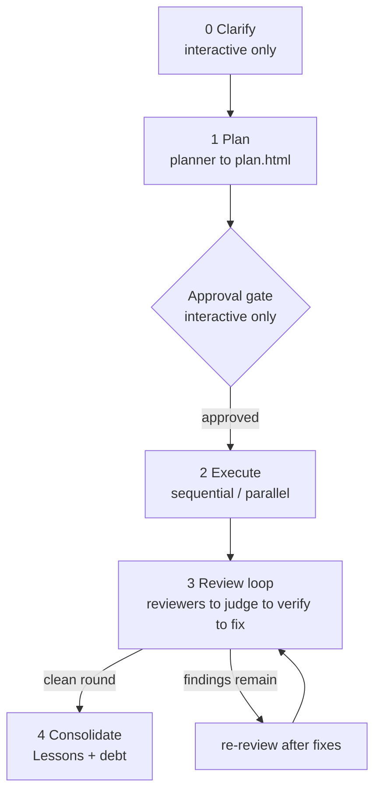

# How it works

A supership run is five stages driven by real code. The main agent authors `eval` cells that call the named global agents and record everything to a self-rendering dashboard.

## The five stages

1. **Clarify.** The planner in CLARIFY mode returns a dependency-ordered question tree, each question carrying a recommended answer it derived from the code. The main agent then grills you one question at a time, upstream decisions first, and produces a CLARIFIED SPEC. That spec, not the raw request, becomes the run's `TASK`. Auto runs skip this entirely.
2. **Plan.** The planner in PLAN mode returns a structured plan. The main agent writes it to the dashboard. See [Planning](/pipeline/planning).
3. **Execute.** Workers implement each piece. The wave shape (sequential, disjoint parallel, or overlapping parallel) comes from the plan. See [Execution](/pipeline/execution).
4. **Review.** The shared review loop fans reviewers out per lens, judges, verifies, and fixes until a clean round. See [Review](/pipeline/review).
5. **Consolidate.** Final state is written, lessons and debt are harvested, and per-repo memory captures the lessons. See [Consolidate](/pipeline/consolidate).

## The dashboard

Durable state lives in `.planning/<slug>/plan.html`. The `<script id="plan-data">` JSON is canonical and the visible page is a derived render. Open it in a browser and it live-refreshes every five seconds while the run is active, then stops once the status is `done` or `failed`.

Every write is code-driven from the pipeline, never trusted to agent memory, so the dashboard cannot drift from reality. The file is the source of truth. Each eval cell re-reads it, which is what makes the whole run resume-safe. The page is dark, dependency-free, `file://`-safe, and renders with `textContent` only so agent text cannot inject markup.

## MODE, interactive versus auto

`MODE` is set in the first eval cell.

- **interactive** (via `/supership`, `/ultraship`) runs the clarify interview and pauses at the approval gate. The plan's status starts as `awaiting_approval`.
- **auto** (via `/shipit`, `/ultrashipit`) skips both. Cell 1 sets the approval state to `auto` and the status to `building`, so Cell 2 runs immediately.

## Eval cells and the recursion-depth rule

The main agent authors and runs the pipeline as `eval` cells with `language: "py"`, using `agent()`, `parallel()`, and `completion()`. Orchestration is never handed to a nested orchestrator agent.

Every cell is the assignment lines plus the SHARED HELPERS block plus that cell's body. The eval kernel persists state between cells, but re-including the helpers is harmless and keeps each cell runnable cold (which is how resume works).

Recursion depth is a hard contract. The main agent is depth 0, each `agent()` child adds 1, and a spawner may call `agent()` only while its depth is below `task.maxRecursionDepth` (the eval hard cap is 3). Authoring the pipeline at depth 0 keeps consultants you spawn at depth 1, which leaves them room for their own scouts at depth 2. This is why the kit asks for `maxRecursionDepth: 3`.
