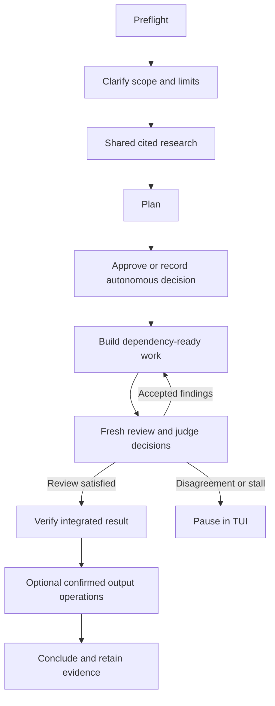

# How it works

All five commands use one engine. The extension makes sure that state transitions, approvals, tool actions, results, and recovery meet the workflow requirements. A state transition changes recorded workflow progress.

The main OMP agent does typed next-action instructions in its existing session. Typed instructions define their required data structure.

```mermaid
flowchart TD
  A[Preflight] --> B[Clarify scope and limits]
  B --> C[Shared cited research]
  C --> D[Plan]
  D --> E[Approve or record autonomous decision]
  E --> F[Build dependency-ready work]
  F --> G[Fresh review and judge decisions]
  G -->|Accepted findings| F
  G -->|Review satisfied| H[Verify integrated result]
  H --> I[Optional confirmed output operations]
  I --> J[Conclude and retain evidence]
  G -->|Disagreement or stall| P[Pause in TUI]
```

Autonomous mode skips the interview and ordinary approval steps. It preserves the other transitions and safety requirements. Review-only mode starts from a fixed local diff scope, the selected set of file changes.

## Durable authority

`.planning/<slug>/state.json` is an atomic snapshot, a complete state version that replaces its predecessor. `events.jsonl` retains decisions, hashes, evidence summaries, and OMP artifact/history references without changing earlier entries. Hashes identify content. Artifacts retain work evidence.

These files do not duplicate complete model transcripts. Unknown schema versions fail before side effects. A schema defines the required data structure. Side effects change state outside the calculation itself.

The engine generates `plan.html` as read-only presentation. The TUI, a terminal user interface, controls approvals, plan edits, tool grants, disagreements, and recovery. A grant authorizes access to a tool.

Local `.planning/` data stays ignored. For deliberate sharing, use a sanitized export, text with sensitive details removed. Do not commit raw run data.

## Session execution

Finite groups use current task or JavaScript `agent()` handles and `wait()`. A handle refers to active work. WorkPool schedules repeated independent tasks. The engine stores logical actions and items separately from temporary handles, pools, and worker processes.

Each managed action binds the run, revision, input hash, expected recipients, and a one-time receipt, a record of the observed result. Ordinary bridged `tool.*` calls pass normal extension hooks, notifications about tool events.

Eval-only handle and pool operations need explicit managed receipts because they do not independently emit every ordinary tool event. Eval means code evaluation within a persistent session.

This cooperative workflow is not a sandbox, a boundary that restricts code effects. Approved JavaScript, shell code, and parent callbacks can cause effects outside the managed protocol. A callback is a function that another task invokes. See [Architecture](/docs/reference/architecture).
