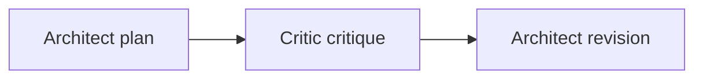
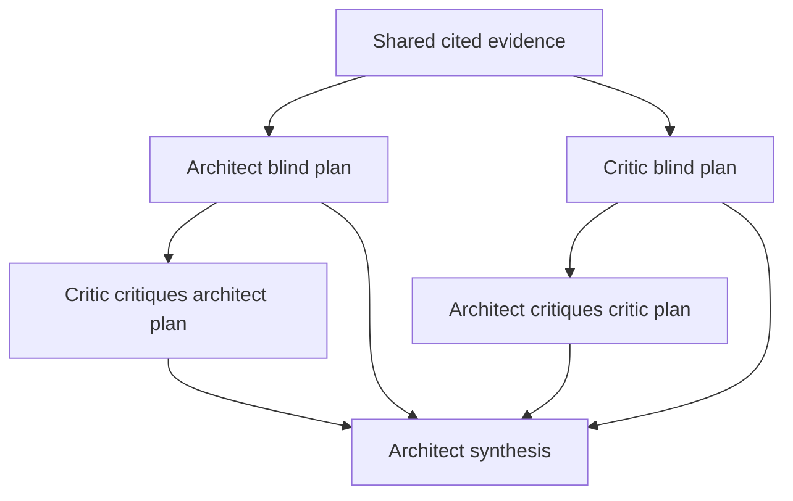
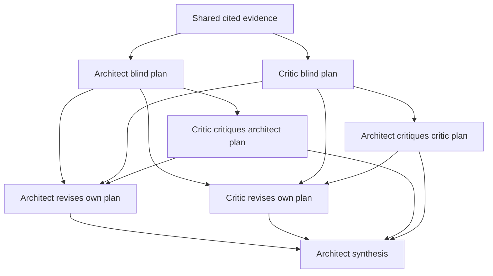

# Planning topologies

A topology defines the order of planning calls. The first ultra argument selects `crossreview`, `duel`, or `debate`. The default is `duel`. Counts exclude shared research, retries, and later review.

## Crossreview: three calls

The architect revises its own plan against the critique. It records accepted and rejected points with reasons.

## Duel: five calls

The architect and critic produce plans concurrently without access to the rival plan. Both then critique the rival plan concurrently. The architect combines both plans and both critiques into a final plan.

## Debate: seven calls

After the independent plans and cross-critiques, both seats revise their own plans concurrently. A seat assigns an agent and model. Each revision receives its own plan, the rival plan, and the critique it received.

The architect combines the revised plans and both critiques. This adds exactly one revision round. It does not create an unlimited planning debate.

The critic acts as a planner during blind-plan and own-plan revision calls. Every dependent step receives named prior outputs explicitly. No topology permits missing seats, stale revisions, or undeclared fallback models. A fallback supplies an alternative after failure.

Planning topology does not set review topology. [Ultra review](/docs/ultra/review) always uses two independent judges.
